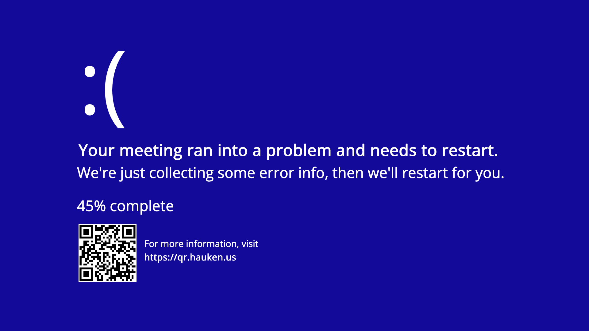

# qr

A static site to shame people who scan random QR codes without thinking about it.

## Why

This repo exists because I kept catching people scanning a QR code from my Teams, Zoom, and other meeting backgrounds from the original Windows BSOD that i was using as a background. I wanted to make a QR code that would be safe to scan, but also a bit of a joke about the fact that people are scanning random QR codes without thinking about it.

## No, but seriously, why?

The page it links to is intentionally harmless and mostly a joke with a real point: random QR codes are still random links, and people should treat them with the same skepticism they would give a mystery URL.

## Can i see it?

Live page: [https://qr.hauken.us](https://qr.hauken.us)

The repo also includes a QR code in `./assets/` and a sample Teams/Zoom/Slack backgrounds for anyone who wants to reuse the idea.

## What's it look like?

## Where is the web page hosted?

Its hosted right here, on GitHub Pages, with a CNAME record for `qr.hauken.us`. The source code for the page is in this repo, so you can see how it works and modify it if you want to.

## Can i have it?

Yes, download it from [the assets folder](./assets/) and use it as you like. The code for the page is also available in this repo, so you can modify it if you want to. 

This is distributed under the MIT License so you can do whatever you want with it, just don't blame me if someone scans it and gets a virus or something.
